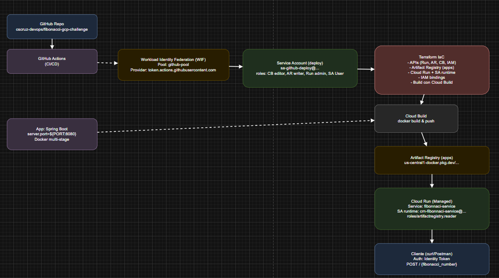

Fibonacci GCP Challenge
Overview

This project implements a Fibonacci microservice using Spring Boot, Docker, and Google Cloud Run, fully provisioned through Terraform.
It calculates the next Fibonacci number for any given input and demonstrates a modern, automated deployment workflow in Google Cloud Platform (GCP).

🧩 Architecture Overview
[ Developer / GitHub ] 
          |
          v
[ Cloud Build ] ---> [ Artifact Registry (Docker images) ]
          |
          v
[ Cloud Run Service (fibonnaci-service) ]
          |
          v
      [ User Requests via HTTPS ]

      

🚀 Components
Layer	              Technology	                                       Purpose
Infrastructure	      Terraform	                                           Automates GCP resource provisioning
Compute	              Cloud Run	                                           Runs the containerized Fibonacci service
Containerization	  Docker	                                           Builds the Spring Boot application image
CI/CD (future)	      GitHub Actions + Workload Identity Federation	       Secure, automated deploys from GitHub to GCP
Image Repository	  Artifact Registry	                                   Stores container images
Build Service	      Cloud Build	                                       Builds and pushes Docker images
IAM	                  Service Accounts + Custom roles	                   Controls access between Cloud Build, Cloud Run, and Artifact Registry

🏗️ Deployment Flow (Terraform)

1-Enable APIs

run.googleapis.com
cloudbuild.googleapis.com
artifactregistry.googleapis.com
iam.googleapis.com

2-Create Artifact Registry
Stores Docker images in us-central1/apps.

3-Create Service Accounts

crn-fibonnaci-service → used by Cloud Run.
379153930775@cloudbuild.gserviceaccount.com → used by Cloud Build.

4-IAM Permissions

Cloud Build → roles/artifactregistry.writer
Cloud Run → roles/artifactregistry.reader
Compute SA → roles/storage.objectAdmin (to fix GCS build upload permission)

5-Build and Push Image
Terraform triggers:

gcloud builds submit --region=us-central1 \
  --tag=us-central1-docker.pkg.dev/visby-coding-challenge-cesley/apps/fibonnaci-service:1.0.0 .

6-Deploy Cloud Run
Terraform provisions:

resource "google_cloud_run_v2_service" "svc" {
  name     = "fibonnaci-service"
  location = "us-central1"
  template {
    containers {
      image = "us-central1-docker.pkg.dev/visby-coding-challenge-cesley/apps/fibonnaci-service:1.0.0"
      ports { container_port = 8080 }
    }
    scaling { min_instance_count = 0, max_instance_count = 10 }
    service_account = "crn-fibonnaci-service@visby-coding-challenge-cesley.iam.gserviceaccount.com"
  }
}

🧮 Spring Boot Application

Directory: /app
This is a simple REST API built with Java 17 + Spring Boot, exposing a single POST endpoint:

POST /

Body:

{
  "fibonacci_number": 8
}

Response:

{
  "next_fibonacci_number": 13
}

Configuration Fix

To ensure compatibility with Cloud Run health checks, the app listens on the dynamic port:

server.port=${PORT:8080}

🧰 Testing the Service

Once deployed, you can test it locally or remotely:

SERVICE_URL="https://fibonnaci-service-x6aokx6xoq-uc.a.run.app"

curl -s -X POST \
  -H "Authorization: Bearer $(gcloud auth print-identity-token)" \
  -H "Content-Type: application/json" \
  -d '{"fibonacci_number":21}' \
  "$SERVICE_URL/"

Expected output:

{"next_fibonacci_number":34}

🔐 IAM Recap
Service Account	                                                            Role	                        Purpose
379153930775-compute@developer.gserviceaccount.com	                        roles/storage.objectAdmin	    Access GCS build objects
379153930775@cloudbuild.gserviceaccount.com	                                roles/artifactregistry.writer	Push Docker images
crn-fibonnaci-service@visby-coding-challenge-cesley.iam.gserviceaccount.com	roles/artifactregistry.reader	Pull image to Cloud Run
⚙️ Future CI/CD Integration

Next steps to integrate a secure GitHub Actions pipeline:

1-Configure Workload Identity Federation between GitHub and GCP.
2-Assign deploy permissions to a new SA (e.g., sa-github-deploy).
3-Add .github/workflows/deploy.yml to trigger on merge to main.

This eliminates local credentials and enables passwordless OIDC authentication from GitHub to GCP.

📚 Maintainer

Cesley Sousa Cruz (cscruz-devops)
Multi-cloud Engineer / DevOps / SRE

🪪 License

This project is licensed under the MIT License — see the LICENSE file for details.